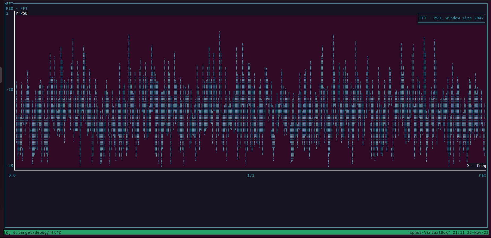

# Overview

This was an exercise in calculating FFT and than trying to make it graphical with tui-rs. I curently am using termion because I liked the battle ships example hosted on the tui page.
But be forwarned I faced density issues in rendering FFTs. TUI even with braille dots I ended up with a wall of points that made it difficult to make out the signals that were there.
I had a similar exercise using gplot with better luck potentially using something like that than rending via tui would be a better

## FFT details
I use a hand rolled custom FFT implementation. It should work for all powers of 2. It works on an in place algorithm using a custom sequence generator. I think I could improve several 
parts for example the bit reversal is very slow. I think i could use fixed point numbers I saw an excellent blog the day I pushed to github on the FFT that does this for speed. I think
I also would like to benchmark this 

## things to try
- [ ] Render image with gplot and use tui to render an image similar to here 
- [ ] Render Waveform with tabs and a zooming option/  since we have IQ try an IQ plot

## Other Repos and credits
Checkout out https://github.com/lquinn2015/EN605.617/tree/master/final  -- this was my original project in CUDA, I might implement something similar eventually It also has data credit 

## Controls
C-c - quits

q/w -- scroll on the FFT

a/s -- zoom in an out of the FFT if you go negative your FFT will disappear :) 

